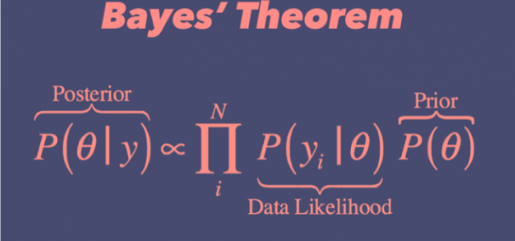

## Description
This course covers the theoretical and applied foundations of Bayesian statistical analysis at a level that goes beyond the introductory course. Therefore, knowledge of basic Bayesian statistics (such as that obtained from the Bayesian Modeling for the Social Sciences I: Introduction and Application workshop) is assumed. The course will consist of four modules. First, we will discuss Bayesian stochastic simulation in depth with a focus on understanding important theoretical properties of common MCMC sampling algorithms. Second, the course will cover model checking, model assessment, and model comparison, with an emphasis on computational approaches. Advanced topics covered during these two modules include data augmentation and Bayesian model averaging. The third module introduces Bayesian variants of "workhorse" social science models, such as linear models, models for binary and count outcomes, discrete choice models, and seemingly unrelated regression. The fourth week will focus on more advanced Bayesian models, such as hierarchical/multilevel models, models for panel and time-series cross-section data, latent factor and item response theory (IRT) models, as well as instrumental variable models. Throughout the workshop, we emphasize not only estimation with modern software tools (R/JAGS/STAN/PyMC), but also how to communicate results effectively. Check more details on ICPSR's [website](https://web.cvent.com/event/c52c2430-aaad-4474-9daf-8511328bc322/websitePage:645d57e4-75eb-4769-b2c0-f201a0bfc6ce). 

